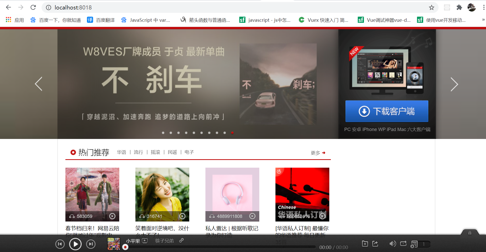
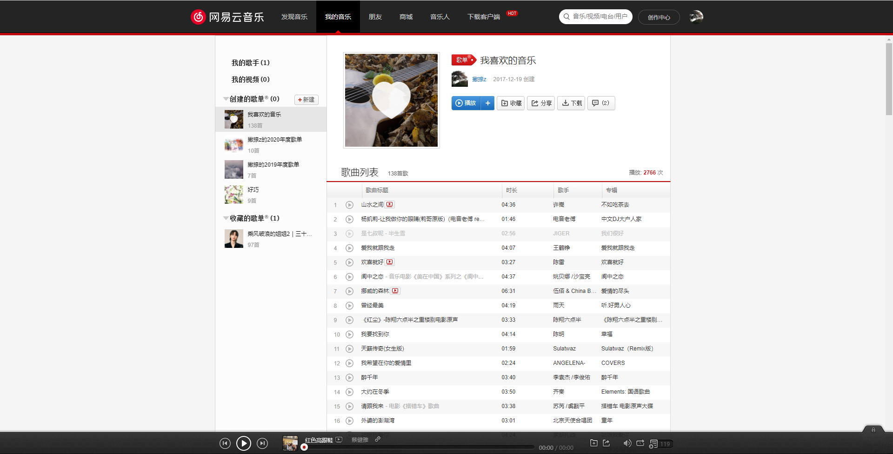
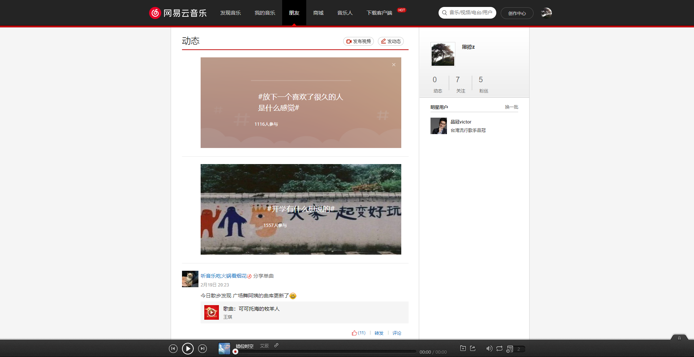
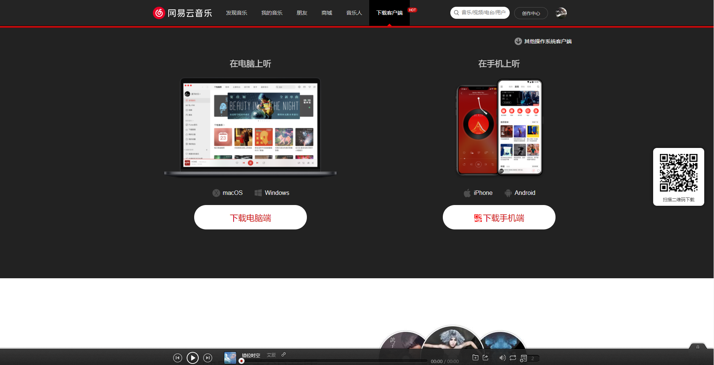
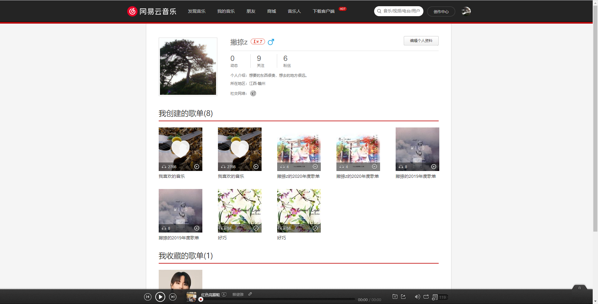

### NeteaseCloudMusic

线上地址：[http://n.xlz122.cn](http://n.xlz122.cn)

### 简介

本项目是一个仿写网易云PC端网站项目。

本项目后端部分使用 Binaryify 的nodejs版的网易云API。

项目使用线上地址，如果线上地址不可用，需将网易云API项目下载到本地，并安装依赖运行，
更改 vue.config.js 的代理地址，更改为网易云API项目ip地址。

网易云API项目github地址: [https://github.com/Binaryify/NeteaseCloudMusicApi](https://github.com/Binaryify/NeteaseCloudMusicApi)

网易云线上API接口文档地址: [https://wyy.wangpinpin.com/](https://wyy.wangpinpin.com/)

如有问题，请联系QQ``122874722``。

### 项目使用技术栈

本项目使用到的技术栈如下：
* Vue全家桶
* Vue3.0 Composions Api
* TypeScript

## 加入项目

如果想加入本项目的开发，需将项目fork到自己的仓库下，功能开发完成后，提PR即可。
  
### 功能说明

* 目前完成：

	* 基本页面结构搭建
	* 扫码登录完成
	* 手机号登录完成
	* 网易邮箱登录完成
	* 首页完成90%
	* 我的音乐完成90%
	* 音乐播放器完成80%
	* 朋友页面95%
	* 下载页面完成
	* 创作中心页面完成
	* 歌单页面完成
	* 歌单详情页面完成
	* 歌手页面完成
	* 歌手详情页面完成
	* 歌去详情页面完成80%
	* 新碟上架页面完成80%
### 项目说明

启动项目

```
yarn install
```

```
yarn serve
```

项目打包

```
yarn build
```

### 项目效果图






## 写在最后

* 本项目仅用于学习使用，切勿用于商业用途，否则产生的法律后果与作者无关。
