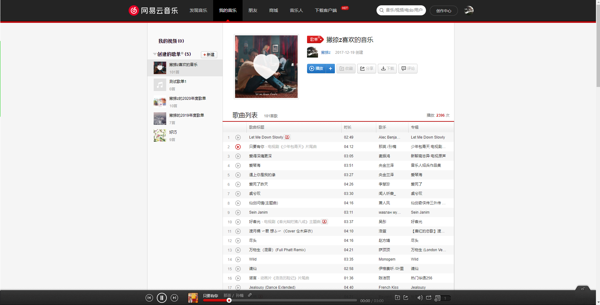

### 简介

本项目是一个仿写网易云PC端网站项目。

本项目后端部分使用 Binaryify 大神nodejs版的网易云API。

网易云API项目github地址: [https://github.com/Binaryify/NeteaseCloudMusicApi](https://github.com/Binaryify/NeteaseCloudMusicApi)

启动项目前，需将此项目下载，并安装依赖运行。

如有问题，请联系QQ``122874722``。

### 项目使用技术栈

本项目使用到的技术栈如下：
* vue全家桶
* vue3.0 Composions Api
* TypeScript

## 加入项目

如果想加入本项目的开发，需将项目fork到自己的仓库下，功能开发完成后，提PR即可。
  
### 功能说明

* 目前完成：

	* 基本页面结构搭建
	* 扫码登录
	* 下载页面
	* 我的音乐完成50%
	* 音乐播放器完成50%
### 项目说明

启动项目

```
yarn install
```

```
yarn serve
```

项目打包

```
yarn build
```

### 项目效果图


## 写在最后

* 本项目仅用于学习使用，切勿用于商业用途，否则产生的法律后果与作者无关。
